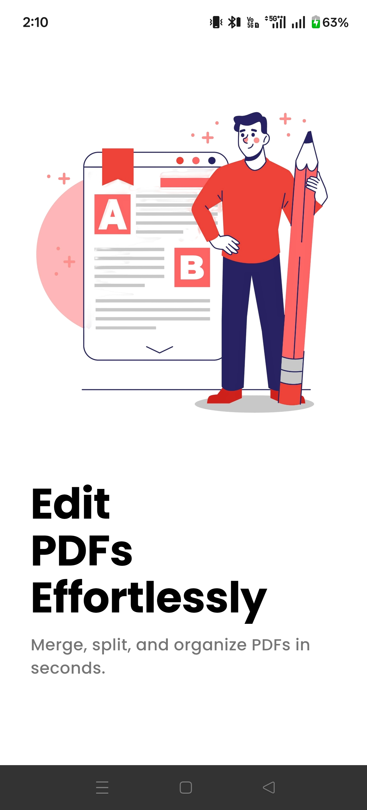
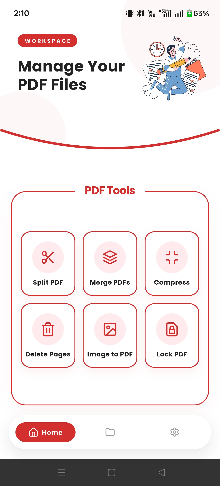
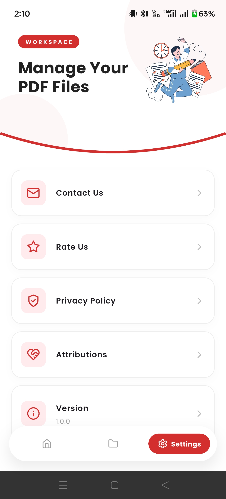
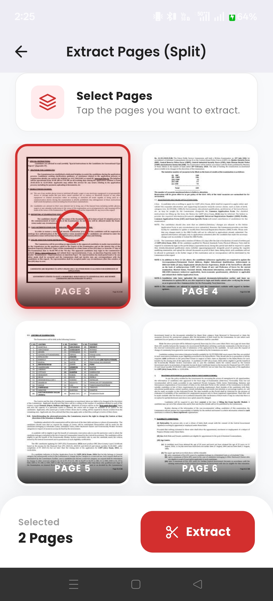
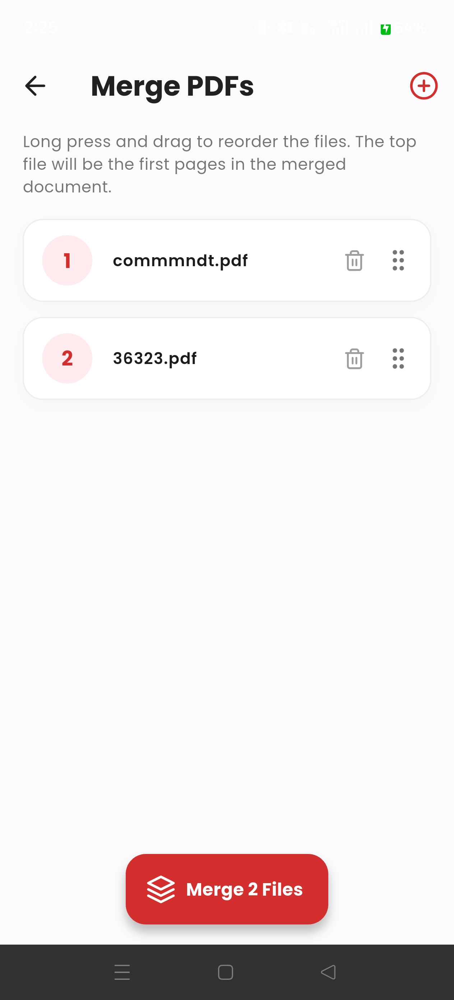
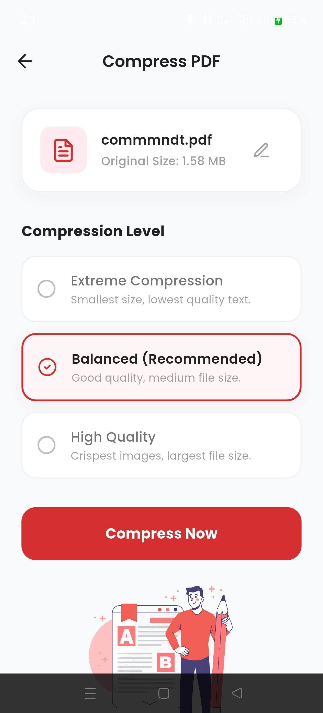
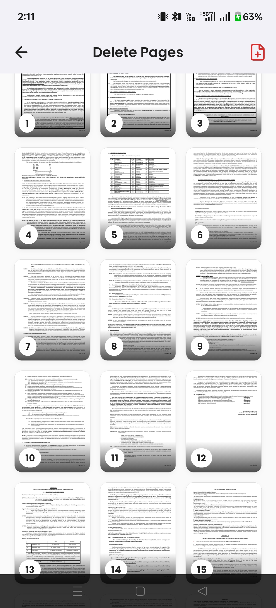
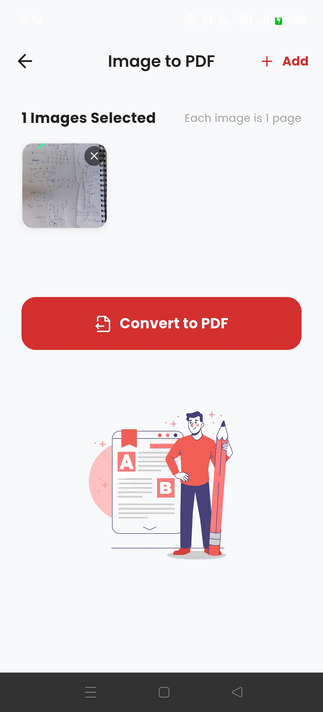
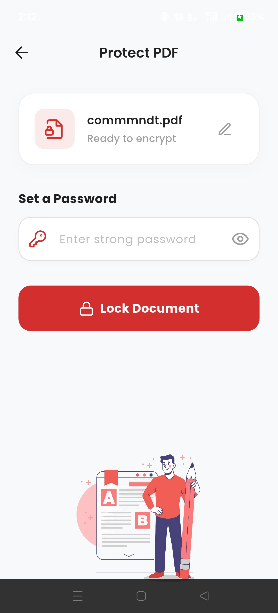

# Split PDF

Split PDF is a fast, offline application built to make PDF management simple, secure, and efficient. The app allows users to perform common document operations such as splitting, merging, compressing, converting images to PDF, and securing files with a password all directly on the device.

Unlike many online tools, Split PDF processes everything locally. Your files never leave your device, ensuring full privacy and faster performance.

## Features

### Split PDF
Extract selected pages from a PDF document and create new files. This allows users to isolate only the pages they need without altering the original document.

### Merge PDFs
Combine multiple PDF documents into a single file. Files can be reordered easily using a drag-and-drop interface before merging.

### Compress PDF
Reduce the size of large PDF documents while maintaining readability. This is useful when sharing files through email or messaging platforms with size limits.

### Delete Pages
Preview all pages of a document and remove unwanted pages with a simple tap. The resulting document is automatically saved as a new file.

### Image to PDF
Convert images or photos into a neatly formatted PDF document. Multiple images can be arranged in order before generating the final file.

### Lock PDF
Protect sensitive documents by applying password encryption, ensuring only authorized users can open the file.

### Built-in Workspace
A dedicated workspace allows users to view, manage, and share all generated PDFs without leaving the app.

---
## Screenshots
---

| Splash | Home | Settings |
|------|------|------|
|  |  |  |

| Split | Merge | Compress |
|------|------|------|
|  |  |  |

| Delete Pages | Image to PDF | Lock PDF |
|---|---|---|
|  |  |  |

---

## Technology Stack

Split PDF is built using modern Flutter technologies to ensure performance and maintainability.

- **Framework:** Flutter (Dart)  
- **State Management:** Riverpod  
- **Routing:** GoRouter  
- **PDF Processing:** Syncfusion PDF, PDFx  
- **UI:** Google Fonts, Lucide Icons, Flutter Animate  
- **File Handling:** File Picker, Path Provider, Share Plus

## Privacy Policy

Split PDF is designed with privacy as a core principle.

All document processing occurs entirely on the user's device. No files are uploaded, transmitted, or stored on external servers. The application does not collect document data or user files.

This ensures that sensitive documents remain completely private and under the user's control.

---
